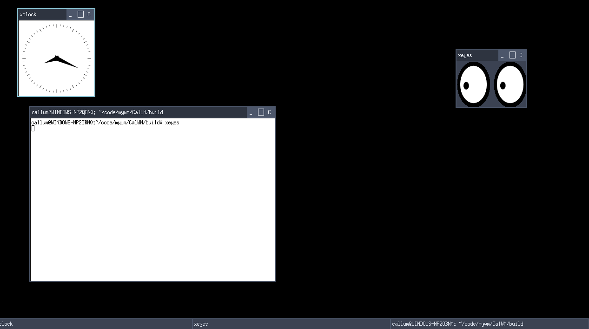

# CalWM
(AKA, the only window manager for linux that impliments things the desktop environment normally handles. also. its *stupidly* minimalist.)

# SETUP (compiling from source)
1. clone the repository  (git clone https://github.com/glkdrlgkrlzflnjkgh/CalWM.git)
2. install dependancies!  (I'm not listing deps here. please refer to main.c for dependancies.)
3. ensure you have make installed (you'll need it to compile CalWM!) (sudo apt install make) though do note that make is yes builtin on many distros.
4. cd into the cloned repository and run the make command.
5. If all goes well. and the build succeeds. you have successfully built CalWM from source!

# WHAT CALWM WILL *NEVER* INCLUDE
*(A non exhaustive list of what I will banish from CalWM faster than you can say wayland is good.)*

1. Telementery (Because nobody enjoys corporate stealing our data and selling it to a random hacker called bob living in his grandma's basement...)
2. AI integration (Because AI lies. ALOT. And I *REALLY REALLY REALLY REALLY* do not want AI bloat cluttering everyone's lives.)
3. Damn wayland (Because writing a compositor would probably end with me dying of old age 5 seconds before I push my changes, and also. I dont want wayland because its a buggy mess, oh and I will go full rant mode if you ask me to add wayland. *seriously.*)
4. "Eye candy" features (They waste performance and add unnecassary programming work. Im one person. not 20!)

# KNOWN ISSUES
1. trying to move the content of a window with a custom titlebar will cause it to move, I think it is an issue with how I am handling titlebars, please open a PR if you believe you have found a fix.

# SCREENSHOTS! (locally taken in WSL2)

  

